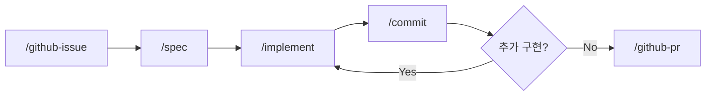

# AI-Native Development Guide

Claude Code 기반 Spec-Driven 개발 워크플로우

## 요구사항

- [Claude Code CLI](https://docs.anthropic.com/en/docs/claude-code) 설치
- GitHub CLI (`gh`) 설치
- 추가 플러그인 불필요

## 개발 사이클

```
Issue → Spec → Implement → Commit → PR
```

| 단계 | 스킬 | 설명 |
|------|------|------|
| 이슈 | `/github-issue` | GitHub 이슈 생성, 라벨 매핑, 브랜치명 제안 |
| 명세 | `/spec` | 요구사항 분석, 아키텍처 설계, 다이어그램 |
| 구현 | `/implement` | 설계 문서 기반 코드 구현 |
| 커밋 | `/commit` | diff 리뷰, 커밋 메시지 제안, 커밋 |
| PR | `/github-pr` | PR 생성, 이슈 연결 |

### 사이클 흐름



## 이슈 사이징 기준

1개 이슈 = 1개 개발 사이클의 단위

| 항목 | 기준 |
|------|------|
| 작업 시간 | 1일 8시간 이내 완료 가능 |
| 변경 파일 수 | 15개 미만 |
| PR 단위 | 이슈 1개 = PR 1개 |

> **예외**: 리팩토링, 패키지 변경 등 단순 반복 변경으로 파일 수가 많은 경우는 파일 수 제한에서 제외합니다.

### 이슈가 너무 크다면

- 하위 이슈로 분할
- 각 하위 이슈가 위 기준을 만족하도록 조정
- 각각 독립적으로 PR 가능한 단위로 분리

## 스킬 동작 방식

스킬은 `.claude/skills/*/SKILL.md` 파일로 정의됩니다.

| 특성 | 설명 |
|------|------|
| 로딩 시점 | `/스킬명` 슬래시 커맨드 입력 시에만 로딩 |
| 토큰 소비 | 호출 전까지 컨텍스트에 포함되지 않음 |
| 의존성 | Claude Code CLI만 필요 (플러그인 불필요) |

비교:

| 파일 | 로딩 | 토큰 영향 |
|------|------|-----------|
| `CLAUDE.md` | 매 턴 자동 로딩 | 항상 소비 |
| `skills/*/SKILL.md` | `/명령어` 호출 시만 | 호출 시만 소비 |

> **설계 원칙**: 항상 적용되는 규칙은 `CLAUDE.md`에, 특정 워크플로우 상세는 `skills/`에 분리하여 토큰을 절약합니다.

## 디렉토리 구조

```
.claude/
├── README.md               # 이 파일 (워크플로우 가이드)
├── settings.json            # 공통 설정 [Git 추적]
├── settings.local.json      # 로컬 설정 [Git 무시]
└── skills/                  # 워크플로우 스킬 [Git 추적]
    ├── github-issue/SKILL.md  # /github-issue
    ├── spec/SKILL.md          # /spec
    ├── implement/SKILL.md     # /implement
    ├── commit/SKILL.md        # /commit
    └── github-pr/SKILL.md     # /github-pr
```

## 다른 프로젝트에 적용

이 `.claude/` 디렉토리를 그대로 복사하면 동일한 워크플로우를 사용할 수 있습니다.

```bash
cp -r .claude/ /path/to/other-project/.claude/
```

프로젝트별 커스텀이 필요하면:
- `CLAUDE.md`에 프로젝트 고유 규칙 추가
- `settings.local.json`에 로컬 설정 추가
- 스킬 내용은 범용이므로 수정 불필요
