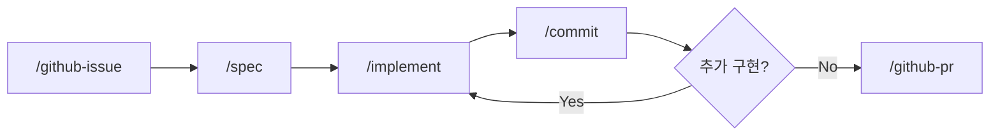

# claude-devex

AI-Native DevEx: Claude Code 기반 이슈 사이클 워크플로우

## AI-Native DevEx란

마크다운 명세를 중심으로 AI 에이전트가 개발 사이클을 수행하는 개발 방식입니다.

> **한줄 요약**: 이슈 → 명세 → 구현 → 커밋 → PR, 각 단계를 슬래시 커맨드 하나로 실행

## 이슈 사이클



| 단계 | 스킬 | 하는 일 |
|------|------|---------|
| 이슈 | `/github-issue` | GitHub 이슈 생성, 라벨 매핑, 브랜치명 제안 |
| 명세 | `/spec` | 요구사항 분석, 아키텍처 설계, 다이어그램 |
| 구현 | `/implement` | 설계 문서 기반 코드 구현 |
| 커밋 | `/commit` | diff 리뷰, 커밋 메시지 제안, 커밋 |
| PR | `/github-pr` | PR 생성, 이슈 연결 |

각 스킬은 독립적으로도 사용할 수 있고, 사이클 순서대로 사용하면 이슈 하나가 PR 하나로 완결됩니다.

## 이슈 사이징 기준

1개 이슈 = 1개 개발 사이클

| 항목 | 기준 |
|------|------|
| 작업 시간 | 1일 8시간 이내 완료 가능 |
| 변경 파일 수 | 15개 미만 |
| PR 단위 | 이슈 1개 = PR 1개 |

이슈가 너무 크면 하위 이슈로 분할하여 각각 독립적으로 PR 가능한 단위로 분리합니다.

## 사용법

### 방법 1: GitHub Template (신규 프로젝트)

1. 이 레포를 템플릿으로 새 레포를 생성합니다.
2. `CLAUDE.md` 하단에 프로젝트 고유 규칙을 추가합니다.
3. `README.md`를 프로젝트에 맞게 수정합니다.

### 방법 2: setup.sh (기존 프로젝트)

```bash
curl -sL https://raw.githubusercontent.com/dykim-base-project/claude-devex/main/setup.sh | bash
```

기존 파일을 덮어쓰지 않으며, `.claude/skills/`만 설치(업데이트)합니다.

## 스킬 동작 방식

스킬은 `.claude/skills/*/SKILL.md` 파일로 정의됩니다.

| 특성 | 설명 |
|------|------|
| 로딩 시점 | `/스킬명` 슬래시 커맨드 입력 시에만 로딩 |
| 토큰 소비 | 호출 전까지 컨텍스트에 포함되지 않음 |
| 의존성 | Claude Code CLI + GitHub CLI만 필요 |

```
CLAUDE.md     → 매 턴 자동 로딩 (항상 토큰 소비)
skills/SKILL.md → /명령어 호출 시만 로딩 (온디맨드)
```

이 설계 덕분에 5개 스킬을 추가해도 평상시 토큰 소비는 0입니다.

## 적용 사례

| 프로젝트 | 설명 |
|----------|------|
| [keycloak-practice](https://github.com/dykim-base-project/keycloak-practice) | Keycloak SSO 연동 실습 (이 워크플로우로 개발) |

## 확장: 프로젝트 특화 스킬 추가

프로젝트 고유 워크플로우가 필요하면 스킬을 추가할 수 있습니다.

```
.claude/skills/
├── github-issue/SKILL.md   # 공통 (claude-devex)
├── spec/SKILL.md            # 공통
├── implement/SKILL.md       # 공통
├── commit/SKILL.md          # 공통
├── github-pr/SKILL.md       # 공통
└── deploy/SKILL.md          # 프로젝트 특화 (직접 추가)
```

스킬 작성법:
1. `.claude/skills/{스킬명}/SKILL.md` 파일 생성
2. 역할, 워크플로우, 규칙을 마크다운으로 정의
3. Claude Code에서 `/{스킬명}`으로 호출

## 파일 구조

```
claude-devex/
├── README.md                      # 이 파일
├── CLAUDE.md                      # 공통 AI 협업 규칙 (템플릿)
├── .gitignore                     # 공통 무시 패턴
├── setup.sh                       # 기존 프로젝트 설치 스크립트
└── .claude/
    ├── README.md                  # 이슈 사이클 상세 가이드
    ├── settings.json              # 기본 권한 설정
    └── skills/
        ├── github-issue/SKILL.md  # /github-issue
        ├── spec/SKILL.md          # /spec
        ├── implement/SKILL.md     # /implement
        ├── commit/SKILL.md        # /commit
        └── github-pr/SKILL.md    # /github-pr
```

## 요구사항

- [Claude Code CLI](https://docs.anthropic.com/en/docs/claude-code)
- [GitHub CLI](https://cli.github.com/) (`gh`)

## 라이선스

MIT
