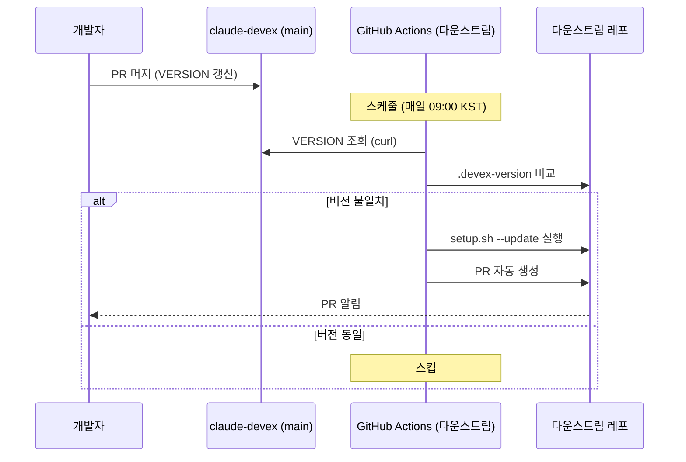

# 스케줄 기반 자동 업데이트 전파 설계

Issue: #3

## 1. 개요

다운스트림 레포가 claude-devex 업데이트를 자동으로 감지하고 PR을 생성하는 체계.

- **발행**: claude-devex는 기존대로 VERSION 파일만 관리 (추가 액션 불필요)
- **구독**: 다운스트림이 스케줄 워크플로우로 자율 확인

## 2. 워크플로우

## 3. 변경 전/후 비교

| 항목 | Before | After |
|------|--------|-------|
| 업데이트 감지 | 개발자가 수동 확인 | 스케줄 자동 감지 |
| 업데이트 실행 | `setup.sh --update` 수동 | GitHub Action이 자동 실행 + PR 생성 |
| 수동 업데이트 | `setup.sh --update` | 그대로 유지 (병행) |
| 다운스트림 설정 | 없음 | `setup.sh --subscribe`로 워크플로우 설치 |
| claude-devex 변경 | - | 없음 (VERSION 파일만으로 충분) |

## 4. 구현 상세

### 4.1 다운스트림 워크플로우 템플릿

파일: `.github/workflows/claude-devex-update.yml`

- `schedule`: 매일 09:00 KST (UTC 00:00) 자동 실행
- `workflow_dispatch`: 수동 트리거 지원
- 버전 비교 → 불일치 시 `setup.sh --update` → PR 자동 생성
- PR 생성: `peter-evans/create-pull-request@v6` 사용

### 4.2 setup.sh `--subscribe` 옵션

- 다운스트림 워크플로우 템플릿을 `.github/workflows/`에 설치
- 기존 `--check`, `--update`와 동일한 패턴

### 4.3 claude-devex 측 변경

| 항목 | 변경 |
|------|------|
| `.github/workflows/claude-devex-update.yml` | 신규 — 다운스트림이 다운로드할 워크플로우 템플릿 |
| `setup.sh` | `--subscribe` 옵션 추가 |
| `README.md` | 자동 업데이트 구독 사용법 추가 |

## 5. 적용 사례 레포 영향 분석

| 레포 | 영향 |
|------|------|
| keycloak-practice | `setup.sh --subscribe` 실행 → 워크플로우 추가 → PR 자동 수신 시작 |
| 기존 설치 | 변경 없음 (opt-in 구독) |
| 미구독 레포 | 기존 수동 `--update` 그대로 사용 |

## 6. 업데이트 안전 영역

| 파일 | 동작 |
|------|------|
| `.github/workflows/claude-devex-update.yml` | `--subscribe` 시 신규 생성 |
| `.claude/skills/*` | `--update`에 의해 갱신 (기존과 동일) |
| `.claude/project-profile.md` | 보존 (기존과 동일) |
| `CLAUDE.md` | 보존 (기존과 동일) |

## 7. 구현 범위 및 제약사항

**범위**:
1. 다운스트림 워크플로우 템플릿 작성
2. `setup.sh --subscribe` 옵션 추가
3. README 문서 반영
4. keycloak-practice 적용 검증

**제약사항**:
- `peter-evans/create-pull-request` 액션 의존 (MIT 라이선스)
- 스케줄 지연 최대 24시간 (수동 `workflow_dispatch`로 즉시 가능)
- GitHub Actions 무료 할당량 내 동작 (월 2,000분, ~1분/회)
